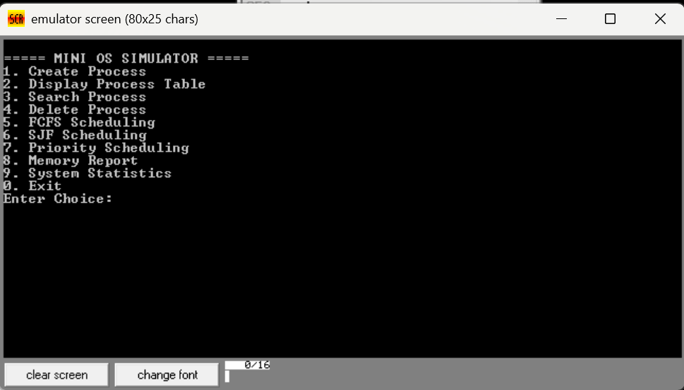
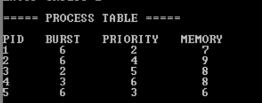
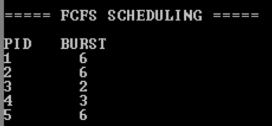
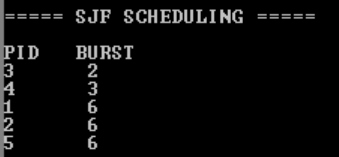
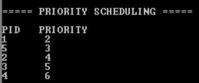
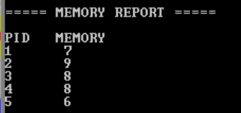
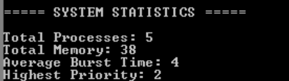

# Assembly-Based Operating System Simulator

## Overview

Assembly-Based Operating System Simulator is a Mini Operating System project developed in 8086 Assembly Language using EMU8086. The simulator demonstrates fundamental operating system concepts including process management, CPU scheduling algorithms, memory reporting, and system statistics.

The project was developed as part of Computer Organization and Assembly Language studies to strengthen understanding of low-level programming and operating system fundamentals.

---

## Features

### Process Management
- Create Process
- Display Process Table
- Search Process
- Delete Process

### CPU Scheduling Algorithms
- First Come First Serve (FCFS)
- Shortest Job First (SJF)
- Priority Scheduling

### Reports & Statistics
- Memory Report
- System Statistics

---

## Technologies Used

- 8086 Assembly Language
- EMU8086 Emulator

---

## Operating System Concepts Demonstrated

- Process Management
- CPU Scheduling
- Memory Management
- Process Statistics
- Arrays and Data Storage
- Procedures and Modular Programming

---

## Project Menu

1. Create Process
2. Display Process Table
3. Search Process
4. Delete Process
5. FCFS Scheduling
6. SJF Scheduling
7. Priority Scheduling
8. Memory Report
9. System Statistics
0. Exit

---

## Screenshots

### Main Menu

### Process Table

### FCFS Scheduling

### SJF Scheduling

### Priority Scheduling

### Memory Report

### System Statistics

---

## Learning Outcomes

This project helped strengthen understanding of:

- Operating System Fundamentals
- CPU Scheduling Algorithms
- Assembly Language Programming
- Memory Handling
- Data Structures using Arrays
- Modular Program Design

---

## Author

Muhammad Huzaifa Imran

BS Artificial Intelligence

HITEC University, Taxila
